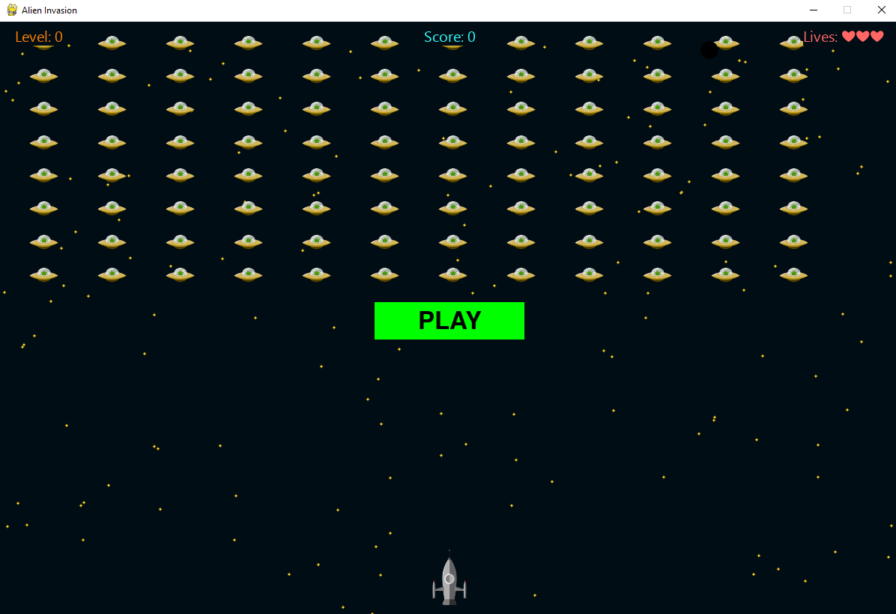

# Alien Invasion
## Description
---
A rocket ship is appearing at the bottom of the screen is controlled by the player. It shoots down the swarm of aliens coming down from the top. Once all the aliens are shot down, the speed of next swarm of aliens increases. If any of the alien reaches bottom of the sreen, the player looses the rocket ship. There are in total 3 lives availble before the game is over. 

* To run the game user needs to run `.\src\main.py` file with `pygame` library installed.
* `src/setting.py` contains all the settings of the game.

## Keys
---
+ `P` or `Play button` : Start game
+ `Reset` : Restart the game
+ `Q` or `X` : Quit the game
 + `arrow left`, `arrow right` : moving ship left and right
+ `spacebar` : Shooting bullets

## Updates
---
- 05 June 2021 - Started the project
- 12 June 2021 - Completed
- 01 July 2021 - Modified readme file

## Credits
---
This game is developed with the help of tutorials presented in the book *Python Crash Course, 2nd edition by Eric Matthes*. Some modifications in the code has been made. Other than this, most of the credit goes to the author for the guidance for creating main structure of the project.
